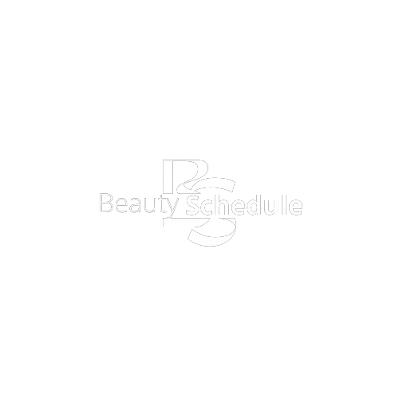
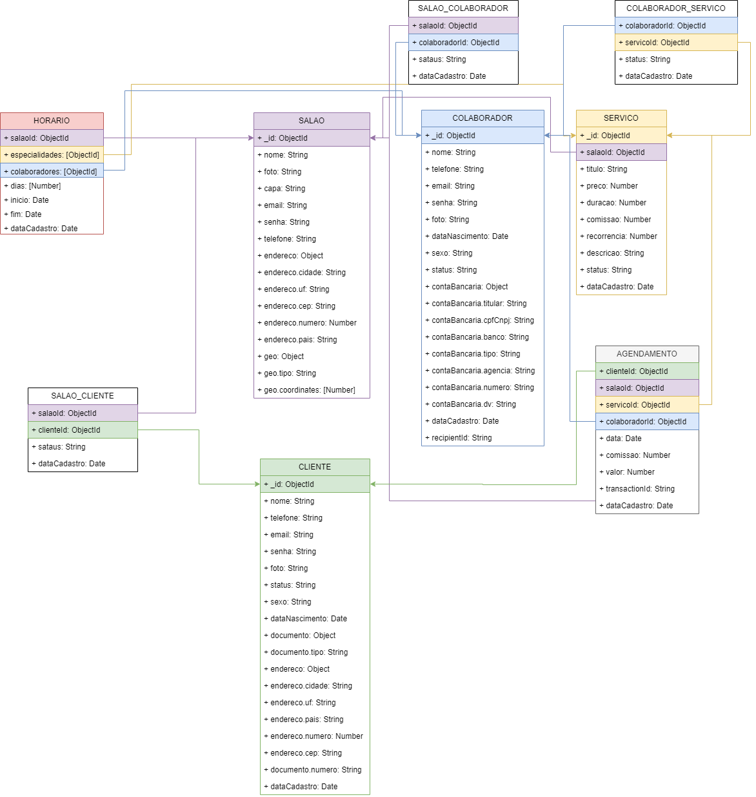

# Beauty Schedule

Sistema de agendamento para salão de beleza

## Índice

- <a href="#funcionalidades-do-projeto">Funcionalidades do Projeto</a>
- <a href="#funcionalidades-do-site">Funcionalidades do Site</a>
- <a href="#funcionalidades-do-aplicativo">Funcionalidades do Aplicativo</a>
- <a href="#layout">Layout</a>
- <a href="#diagrama-de-classe">Diagrama de Classe</a>
- <a href="#demonstração">Demonstração</a>
- <a href="#como-rodar-o-projeto">Como rodar o projeto?</a>
- <a href="#tecnologias-utilizadas">Tecnologias Utilizadas</a>
- <a href="#pessoas-autoras">Pessoas Autoras</a>
- <a href="#próximos-passos">Próximos Passos</a>

## Funcionalidades do Projeto

- [x] Login
- [x] Cadastro do estabelecimento
- [x] Cadastro de cliente, colaborador e serviços
- [x] Agendamento de horário
- [x] Serviços prestados
- [x] Colaboradores de acordo com cada área de atuação

## Funcionalidades do Site

- [x] Login
- [x] Agendamento de horário
- [x] Listagem de serviços prestados
- [x] Colaboradores de acordo com cada área de atuação

## Funcionalidades do Aplicativo

- [x] Login
- [x] Agendamento de horário
- [x] Listagem de serviços prestados
- [x] Colaboradores de acordo com cada área de atuação

## Layout

## Diagrama de Classe

## Demonstração

## Como rodar o projeto?

## Tecnologias Utilizadas

### Web, Website e Web Service
1. [React](https://react.dev/)
3. [Turf Js](https://turfjs.org/)
4. [Redux](https://redux.js.org/)
2. [Pagarme](https://pagar.me/)

### Mobile
1. [React Native](https://reactnative.dev/)

## Pessoas Autoras

[Linkedin](https://www.linkedin.com/in/wagnersjesus/)

## Próximos Passos